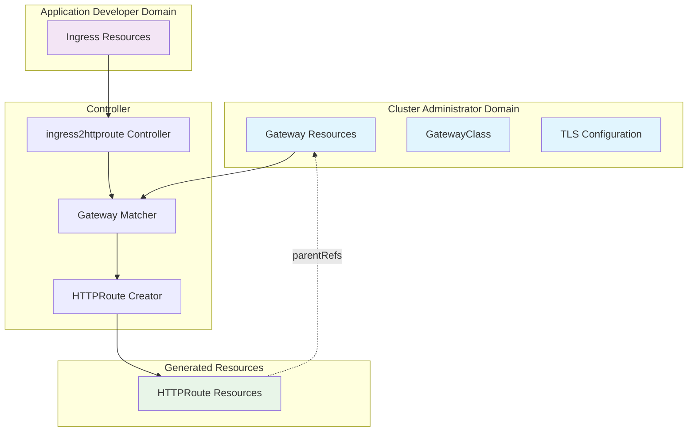

# ingress2httproute Controller Design Document

## Table of Contents

1. [Project Philosophy](#project-philosophy)
2. [Architecture Overview](#architecture-overview)
3. [Design Principles](#design-principles)
4. [Implementation Scope](#implementation-scope)
5. [Comparison with ingress2gateway](#comparison-with-ingress2gateway)
6. [Core Components](#core-components)
7. [Controller Behavior](#controller-behavior)
8. [Configuration and Deployment](#configuration-and-deployment)
9. [Security Considerations](#security-considerations)
10. [Limitations and Trade-offs](#limitations-and-trade-offs)
11. [Use Cases and Target Audience](#use-cases-and-target-audience)

## Project Philosophy

### The "Mounting" Approach

The `ingress2httproute` controller implements a **"mounting"** strategy for Gateway API adoption, fundamentally different from full migration tools. Instead of creating new Gateway infrastructure, it allows application developers to **mount their familiar Ingress resources onto existing, pre-configured Gateway infrastructure** managed by cluster administrators.

### Core Tenets

1. **Infrastructure/Application Separation**: Clear separation between infrastructure concerns (handled by cluster administrators) and application routing concerns (handled by developers)
2. **Developer Experience Preservation**: Maintain the simplicity of Ingress resources while leveraging Gateway API capabilities
3. **Incremental Adoption**: Enable Gateway API adoption without requiring complete infrastructure overhaul
4. **Administrative Control**: Allow cluster administrators to maintain control over network entry points, TLS configuration, and cross-cutting concerns

## Architecture Overview



## Design Principles

### 1. **Non-Invasive Infrastructure Management**

The controller **never creates, modifies, or deletes Gateway resources**. It operates purely by:
- Discovering existing Gateway resources in the cluster
- Matching Ingress hostnames to Gateway listener configurations
- Creating HTTPRoute resources that reference (mount to) appropriate Gateways

### 2. **Hostname-First Gateway Selection**

Gateway selection is based on **hostname compatibility**:
- **Exact matches** take highest priority (`app.example.com` → `app.example.com`)
- **Wildcard matches** take medium priority (`app.example.com` → `*.example.com`)
- **Catch-all gateways** (no hostname restriction) take lowest priority

### 3. **One-to-One HTTPRoute-to-Hostname Mapping**

Each Ingress hostname generates a separate HTTPRoute resource:
- Enables fine-grained route management
- Supports different Gateway attachments per hostname
- Simplifies conflict resolution and debugging

### 4. **Developer-Centric Simplicity**

Developers continue using familiar Ingress patterns:
- Standard Ingress resource definitions
- No Gateway API knowledge required
- Existing CI/CD pipelines remain unchanged

### 5. **Administrator-Controlled Infrastructure**

Cluster administrators maintain full control over:
- Gateway listener configuration (ports, protocols, hostnames)
- TLS certificate management and rotation
- Load balancer and network infrastructure
- Cross-cutting security policies

## Implementation Scope

### ✅ What is Handled

#### **Routing Rule Translation**
- **Path Matching**: Complete support for all Ingress path types:
  - `PathTypePrefix` → `PathMatchPathPrefix`
  - `PathTypeExact` → `PathMatchExact` 
  - `PathTypeImplementationSpecific` → `PathMatchRegularExpression`

#### **Backend Reference Mapping**
- **Service Backends**: Full translation including:
  - Numeric port references (`port: 80`)
  - Named port references with automatic Service lookup (`port: "http"`)
  - Cross-namespace service references (within allowed boundaries)
- **Resource Backends**: Support for custom resource types beyond Services

#### **Gateway Discovery and Selection**
- **Hostname-based Matching**: Intelligent Gateway selection using:
  - Exact hostname matching
  - Wildcard pattern matching (`*.example.com`)
  - Catch-all Gateway support (no hostname restriction)
- **Multi-listener Support**: Automatic attachment to both HTTP and HTTPS listeners when available
- **Namespace Compatibility**: Respects Gateway `AllowedRoutes` namespace restrictions

#### **Resource Management**
- **Owner References**: Proper HTTPRoute lifecycle tied to source Ingress
- **Update-in-Place**: Intelligent updates when Ingress resources change
- **Garbage Collection**: Automatic cleanup when Ingress resources are deleted

#### **Controller Features**
- **Watch-based Reconciliation**: Responds to both Ingress and Gateway changes
- **Deterministic Sorting**: Consistent HTTPRoute rule ordering
- **Conflict Avoidance**: Prevents duplicate HTTPRoute creation through ownership checking

### ❌ What is Deliberately Not Handled

#### **Gateway Infrastructure Management**
- **Gateway Creation**: No automatic Gateway resource creation
- **Gateway Modification**: No changes to existing Gateway configurations
- **GatewayClass Management**: No GatewayClass resource manipulation

#### **TLS Configuration**
- **Certificate Management**: TLS certificates remain Gateway listener responsibility
- **TLS Policy**: No automatic HTTPS redirect or TLS enforcement
- **Certificate Rotation**: Handled entirely by Gateway infrastructure

#### **Default Backend Handling**
- **Fallback Routes**: Ingress `defaultBackend` specifications are ignored
- **Catch-all Behavior**: Default backend patterns require explicit Gateway configuration

#### **IngressClass-to-Gateway Mapping**
- **Class-based Selection**: No built-in IngressClass → Gateway mapping logic
- **Admission Control**: No validation of IngressClass compatibility with available Gateways

#### **Advanced Gateway API Features**
- **Traffic Splitting**: No automatic implementation of canary or blue/green patterns
- **Request/Response Transformation**: Limited to basic routing without modification
- **Rate Limiting**: No automatic policy application beyond basic routing

## Comparison with ingress2gateway

| Aspect | ingress2httproute (This Project) | kubernetes-sigs/ingress2gateway |
|--------|----------------------------------|--------------------------------|
| **Primary Use Case** | Mount Ingress on existing Gateways | Full migration to Gateway API |
| **Gateway Management** | Uses existing Gateways | Creates new Gateway resources |
| **TLS Handling** | Relies on pre-configured Gateway TLS | Generates TLS configuration from Ingress |
| **IngressClass Support** | Manual Gateway selection | Automatic IngressClass → GatewayClass mapping |
| **Default Backend** | Not supported (delegated to Gateway) | Full support with catch-all routes |
| **Deployment Model** | Runtime controller in cluster | CLI tool for one-time conversion |
| **Update Behavior** | Continuous reconciliation | Manual re-run required for updates |
| **Administrator Involvement** | High (pre-configures infrastructure) | Low (automated infrastructure creation) |
| **Developer Experience** | Unchanged Ingress workflow | Requires Gateway API knowledge post-migration |
| **Rollback Capability** | Easy (delete controller) | Complex (requires infrastructure rollback) |

### When to Use Each Tool

#### Use `ingress2httproute` when:
- **Gradual Gateway API Adoption**: Want to experiment with Gateway API without infrastructure changes
- **Centralized Infrastructure Management**: Cluster administrators need control over network entry points
- **Mixed Environment**: Some applications ready for Gateway API, others still using Ingress
- **Development/Testing**: Exploring Gateway API capabilities with existing infrastructure
- **Regulatory Compliance**: Need centralized control over TLS certificates and network policies

#### Use `ingress2gateway` when:
- **Complete Migration**: Ready to fully adopt Gateway API across the cluster
- **New Deployments**: Starting fresh with Gateway API as the primary ingress solution
- **Self-Service Model**: Developers need full control over Gateway infrastructure
- **Complex TLS Requirements**: Need automated TLS configuration management
- **Default Backend Support**: Require comprehensive fallback routing capabilities

## Core Components

### IngressReconciler

The main controller component responsible for:

```go
type IngressReconciler struct {
    client.Client
    Scheme          *runtime.Scheme
    RequireHostname bool  // Optional: Only process rules with hostnames
}
```

**Key Responsibilities:**
- Watch Ingress resources for changes
- Discover and cache Gateway resources
- Orchestrate HTTPRoute creation and updates
- Manage resource ownership and cleanup

### Gateway Discovery Engine (`utils.go:91-115`)

**Hostname-to-Gateway Mapping Logic:**
```go
func groupGatewaysByHostNameAndMapToParentRefs(
    ingressNamespace string, 
    gateways gatewayv1.GatewayList,
) map[string][]gatewayv1.ParentReference
```

**Selection Algorithm:**
1. **Exact Match Priority**: `app.example.com` matches `app.example.com` listener
2. **Wildcard Match Priority**: `app.example.com` matches `*.example.com` listener  
3. **Catch-all Priority**: Any hostname matches gateway with no hostname restriction
4. **Namespace Filtering**: Respects Gateway `AllowedRoutes.Namespaces` configuration

### HTTPRoute Generator (`ingress_controller.go:97-136`)

**Per-Hostname Processing:**
- Creates unique HTTPRoute per Ingress hostname
- Generates deterministic naming: `{ingressName}-{hostname-normalized}`
- Maps all paths for a hostname into single HTTPRoute rules
- Handles both HTTP and HTTPS listener attachment

### Backend Reference Translator (`ingress_controller.go:240-283`)

**Comprehensive Backend Support:**
- **Service References**: Standard Kubernetes Service backends
- **Named Port Resolution**: Automatic Service port lookup for named ports
- **Resource References**: Support for custom resource backends
- **Namespace Scoping**: Proper namespace handling for cross-namespace references

## Controller Behavior

### Reconciliation Loop

1. **Ingress Event Processing**:
   ```go
   func (r *IngressReconciler) Reconcile(ctx context.Context, req ctrl.Request) (ctrl.Result, error)
   ```

2. **Gateway Discovery**:
   - List all Gateway resources cluster-wide
   - Filter by namespace accessibility
   - Group by hostname patterns

3. **HTTPRoute Generation**:
   - One HTTPRoute per Ingress hostname
   - Map Ingress paths to HTTPRoute rules
   - Attach to appropriate Gateway listeners

4. **Resource Management**:
   - Create missing HTTPRoutes
   - Update existing owned HTTPRoutes
   - Preserve externally managed HTTPRoutes

### Watch Patterns

The controller implements comprehensive watch patterns:

```go
func (r *IngressReconciler) SetupWithManager(mgr ctrl.Manager) error {
    return ctrl.NewControllerManagedBy(mgr).
        For(&networkingv1.Ingress{}).           // Primary resource
        Owns(&gatewayv1.HTTPRoute{}).           // Owned resources
        Watches(&gatewayv1.Gateway{}, ...)      // Infrastructure changes
}
```

**Watch Behaviors:**
- **Ingress Changes**: Direct reconciliation of affected resources
- **Gateway Changes**: Re-reconcile ALL Ingress resources (ensures routing updates)
- **HTTPRoute Changes**: Only for resources owned by this controller

### Conflict Resolution

**Ownership-Based Protection:**
```go
func isOwnedBy(metadata metav1.ObjectMeta, owner metav1.OwnerReference) bool
```

- Only modify HTTPRoutes with proper owner references
- Prevent interference with manually created HTTPRoutes
- Enable multi-controller coexistence

## Configuration and Deployment

### Controller Configuration

**Command Line Options:**
```bash
# Basic deployment
--metrics-bind-address=:8080
--health-probe-bind-address=:8081

# Hostname filtering (optional)
--require-hostname=true  # Only process Ingress rules with hostnames
```

**Environment Variables:**
```yaml
env:
- name: REQUIRE_HOSTNAME
  value: "false"  # Process rules without hostnames (creates catch-all routes)
```

### RBAC Requirements

**Minimum Required Permissions:**
```yaml
apiVersion: rbac.authorization.k8s.io/v1
kind: ClusterRole
metadata:
  name: ingress2httproute-controller
rules:
- apiGroups: ["networking.k8s.io"]
  resources: ["ingresses"]
  verbs: ["get", "list", "watch"]
- apiGroups: ["gateway.networking.k8s.io"]
  resources: ["gateways"]
  verbs: ["get", "list", "watch"]
- apiGroups: ["gateway.networking.k8s.io"]
  resources: ["httproutes"]
  verbs: ["get", "list", "watch", "create", "update", "patch", "delete"]
- apiGroups: [""]
  resources: ["services"]
  verbs: ["get", "list", "watch"]  # For named port resolution
```

### Deployment Patterns

#### **Namespace-Scoped Deployment**
```yaml
# Deploy controller in each application namespace
# Processes only local Ingress resources
# Requires minimal cluster-wide permissions
```

#### **Cluster-Wide Deployment**
```yaml
# Single controller instance
# Processes all Ingress resources cluster-wide
# Requires broader RBAC permissions
# Recommended for most deployments
```

## Security Considerations

### Namespace Isolation

**Gateway AllowedRoutes Enforcement:**
```go
func isListenerAccessibleFromNamespace(
    listener gatewayv1.Listener, 
    gatewayNamespace, 
    ingressNamespace string,
) bool
```

- Respects Gateway `AllowedRoutes.Namespaces` configuration
- Prevents unauthorized cross-namespace route attachment
- Maintains Gateway administrator's access control policies

### Resource Ownership

**Protection Against Interference:**
- HTTPRoutes created with proper owner references
- Controller only modifies resources it owns
- External HTTPRoutes remain untouched
- Enables safe multi-controller environments

### Privilege Separation

**Limited Controller Permissions:**
- **Read-only** access to Gateway resources
- **No permissions** to modify Gateway infrastructure
- **Scoped access** to HTTPRoute resources only
- **Service lookup** limited to port resolution needs

## Limitations and Trade-offs

### Design Limitations

#### **No Default Backend Support**
- **Limitation**: Ingress `defaultBackend` specifications are ignored
- **Rationale**: Default behavior should be configured at Gateway level by administrators
- **Workaround**: Configure catch-all routes directly on Gateway resources
- **Impact**: Some Ingress resources may require modification before migration

#### **No TLS Management**
- **Limitation**: No automatic TLS certificate or HTTPS redirect configuration
- **Rationale**: TLS is an infrastructure concern managed by Gateway administrators
- **Workaround**: Pre-configure TLS on Gateway listeners
- **Impact**: Requires coordination between developers and administrators

#### **Basic IngressClass Support**
- **Limitation**: No built-in IngressClass to Gateway mapping logic
- **Rationale**: Gateway selection based on hostname is more flexible than class-based selection
- **Workaround**: Manual Gateway selection through hostname patterns
- **Impact**: Requires different mental model than traditional IngressClass usage

### Operational Trade-offs

#### **Administrator Overhead**
- **Trade-off**: Higher initial setup burden on cluster administrators
- **Benefit**: Centralized control over network infrastructure and security policies
- **Mitigation**: Provide comprehensive Gateway configuration examples and automation tools

#### **Limited Ingress Feature Coverage**
- **Trade-off**: Some Ingress features not automatically supported
- **Benefit**: Simpler, more predictable behavior with fewer edge cases
- **Mitigation**: Clear documentation of supported vs. unsupported features

#### **Gateway API Knowledge Gap**
- **Trade-off**: Administrators need Gateway API expertise for infrastructure setup
- **Benefit**: Developers can remain focused on application concerns
- **Mitigation**: Provide Gateway configuration templates and best practices

## Use Cases and Target Audience

### Primary Use Cases

#### **1. Gradual Gateway API Migration**
**Scenario**: Large organization with hundreds of Ingress resources
**Approach**: 
- Administrators set up Gateway infrastructure for different environments
- Applications gradually opt-in by deploying controller in their namespaces
- No disruption to existing CI/CD pipelines
- Easy rollback by removing controller

#### **2. Multi-Tenant Environments**
**Scenario**: Platform team serving multiple application teams
**Approach**:
- Platform team configures Gateway infrastructure with appropriate TLS and networking policies
- Application teams continue using familiar Ingress resources
- Clear separation of responsibilities and security boundaries
- Centralized monitoring and observability

#### **3. Development and Testing Environments**
**Scenario**: Teams exploring Gateway API capabilities
**Approach**:
- Set up Gateway infrastructure in development clusters
- Experiment with Gateway API features without production risk
- Learn Gateway API concepts gradually
- Compare behavior against existing Ingress setup

#### **4. Compliance and Security-Focused Deployments**
**Scenario**: Organizations with strict network security requirements
**Approach**:
- Security team controls all Gateway infrastructure and TLS certificates
- Application teams maintain development velocity with Ingress resources
- Centralized audit trail for network configuration changes
- Simplified compliance reporting

### Target Audience

#### **Primary: Platform/Infrastructure Teams**
- **Responsibility**: Gateway infrastructure, TLS management, network policies
- **Benefit**: Gradual migration path with maintained control
- **Requirements**: Gateway API knowledge, infrastructure automation skills

#### **Secondary: Application Development Teams**
- **Responsibility**: Application routing requirements via Ingress resources
- **Benefit**: No disruption to existing workflows and CI/CD pipelines
- **Requirements**: Existing Ingress knowledge (no new learning required)

#### **Secondary: Security and Compliance Teams**
- **Responsibility**: Network security policies, certificate management
- **Benefit**: Centralized control point for network security
- **Requirements**: Understanding of Gateway security model

### Anti-Patterns

#### **When NOT to Use This Controller**

1. **Full Gateway API Migration**: Use `kubernetes-sigs/ingress2gateway` instead
2. **Greenfield Deployments**: Start directly with Gateway API resources
3. **Simple Single-Application Deployments**: Direct Gateway API usage may be simpler
4. **Teams Ready for Full Gateway API Adoption**: No need for compatibility layer

---

## Conclusion

The `ingress2httproute` controller fills a specific niche in the Gateway API adoption journey. It provides a **bridge between the simplicity of Ingress and the power of Gateway API**, while maintaining clear separation between infrastructure and application concerns.

This design enables organizations to:
- **Experiment** with Gateway API without infrastructure risk
- **Migrate gradually** at their own pace
- **Maintain control** over critical network infrastructure
- **Preserve** existing developer workflows and CI/CD investments

For teams ready for full Gateway API adoption, the [kubernetes-sigs/ingress2gateway](https://github.com/kubernetes-sigs/ingress2gateway) project provides comprehensive migration capabilities including Gateway creation, TLS management, and full feature support.

The choice between these approaches should be based on organizational readiness, infrastructure control requirements, and migration timeline constraints.